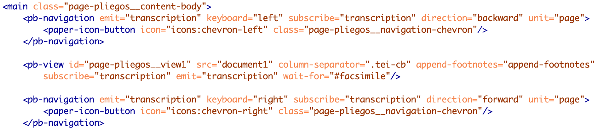

# 2. Les templates

## 2.1. La notice d’un pliego : page-pliegos.html

Ce template permet d’afficher la notice d’un document avec les métadonnées descriptives, le texte et le facsimilé. Il a été créé à partir du template **facsimile.html** proposé par défaut par *TEI-Publisher*.

La page se compose (de haut en bas) d’un menu de navigation général appelé depuis le template **menu.html** ; d’une barre d’outil appelée depuis le template **toolbar.html** (excepté la génération des boutons) ; d’un espace de consultation des métadonnées et des images ; et d’un pied de page. Les métadonnées, le contenu de la table des matières, les informations sur les gravures et les options de téléchargement sont créés avec l’élément `<pb-drawer>`, qui se situe entre l’élément `<app-header>` et l’élément `<main>`.

Les métadonnées sont affichées en cliquant sur le bouton “Métadonnées”, qui fait glisser un panneau à gauche. Pour cela, nous avons repris et adapté le code utilisé pour afficher la table des matières. Ainsi, elles sont gérées par le web-component `<pb-drawer toogle="metadataToogle">`. Il contient un web-component `<pb-view>`, avec un attribut `@xpath` ciblant le `<teiHeader>`. Le web-component `<pb-param>` définit des paramètres (avec les attributs `@name` et `@value`), repris par l’ODD pour sélectionner les métadonnées à afficher, en utilisant le prédicat suivant lors de la création du *model sequence* : `$parameters?mode='commentary'`. Pour le choix des métadonnées, voir 1.9. Les métadonnées.

L’affichage des métadonnées concernant les gravures suit le même procédé, mais avec le paramètre suivant : `$parameters?mode='figures'`.

Nous avons ajouté un bouton “Télécharger”, permettant de télécharger le texte ou les images d’un document. Il est construit sur le même modèle que précédemment, avec un web-component `<pb-drawer>`. Pour l’export du texte en .pdf ou en .epub, nous utilisons les fonctions par défaut de *TEI-Publisher* avec le web-component `<pb-download>`.
En ce qui concerne le téléchargement du code source XML TEI et celui des images, nous avons développé des fonctions spécifiques qui renvoient l’utilisateur vers la plateforme Zenodo. Ces fonctions sont contenues dans le fichier **modules/custom-api.xql**. Le bouton “Comparer” est, quant à lui, directement affiché depuis le template **toolbar.html** (Voir 2.3. La barre d’outils).

Le contenu principal de la page est défini avec l’élément `<main class="page-pliegos_ _content-body">`. La transcription est affichée avec un autre web-component `<pb-view>`, lequel est encadré par deux web-components `<pb-navigation>` permettant de changer de pages (Figure 5).

Le web-component `<pb-facsimile>` permet d’afficher les images du document via le protocole IIIF. L’URI de base est celle du serveur de l’Université de Genève : “https://iiif.unige.ch/iiif/2/”. À cette URI, est concaténé le nom le nom de l’image sur le serveur IIIF. Celui-ci est indiqué dans les fichiers TEI, avec l’élément `<pb/>` et son attribut `@facs`. Dans l’ODD, cet élément est transformé en web-component `<pb-facs-link>`, ce qui permet ainsi d’afficher les images dans `<pb-facsimile>` (Voir 1.3. Les changements de page `<pb/>`...).

## 2.2. La notice d’une illustration (illustration.html)

*TEI-Publisher* permet de définir des templates spécifiques en fonction des collections. Dans le fichier **config.xqm**, il faut modifier la fonction `config:collection-config`. Si la collection s’appelle “Ilustraciones”, alors on applique le template **illustration.html**. Sinon, on applique le template par défaut défini dans le même fichier avec la fonction `config:default-template`.

[Figure 7]

La notice d’une gravure a une organisation plus simple que celle des éditions numériques des documents.

Le fil d’ariane (ou breadcrumb) est créé à l’aide d’une fonction XQuery, qui se trouve dans le fichier **modules/custom-api.xml** et intégré dans chaque notice d’illustration avec `
`.

L’identifiant et la date sont affichés avec l’élément `<app-toolbar>`. Le web-component `<pb-view>` cible l’élément `<fileDesc>` du `<teiHeader>`, tandis que `<pb-param>` définit des paramètres repris par l’ODD avec le prédicat `$parameters?mode='title'` (Voir 1.9. Les métadonnées, `<fileDesc>`).

Sur le même modèle, les métadonnées descriptives sont affichées avec le web-component `<pb-param>`, qui définit des paramètres (avec les attributs `@name` et `@value`) repris par l’ODD avec le prédicat suivant : `$parameters?mode='illustration'` (Voir 1.9. Les métadonnées, <teiHeader>).

Enfin, l’image est affichée avec l’élément `
`, qui fait appelle à la fonction `api:display-illustration`, contenue dans le fichier **modules/custom-api.xql**. Cette fonction récupère les coordonnées d’une gravure sur l’image de la page et les concatène avec l’URI de base du serveur IIIF de l’Université de Genève. Elle affiche ensuite cette URL dans un élément HTML ``.

## 2.3. La barre d’outils : toolbar.html
Ce template permet d’afficher le titre du document et une barre d’outil : par défaut, *TEI-Publisher* propose une table des matières (générée à partir des `
` et des `<head>` du fichier TEI), l’affichage de la collection d’origine, des zooms, des boutons de navigations et l’accès au fichier source du document. Dans notre cas, nous avons uniquement conservé le titre et la table des matières, auxquels nous avons ajouté quatre autres boutons pour l’affichage de métadonnées (document et gravures), pour le téléchargement et pour la comparaison de documents avec *Mirador*.

[IMG de Toolbar]

Le fil d’ariane est créé avec une fonction XQuery, qui se trouve dans le fichier **modules/custom-api.xql**, et intégré dans la barre d’outil avec l’élément `
`.

Le titre est affiché dans un élément HTML `<section classe="page-pliegos__breadcrumbs">` et créé avec un web-component `<pb-view>`. L’attribut `@xpath` permet de cibler le contenu de l’élément TEI à afficher. `<pb-param>` fournit les paramètres à utiliser dans l’ODD pour l’affichage du titre.

Si le contenu des boutons (sauf le dernier) est généré depuis le template page_pliegos.html (Voir 2.1. La notice d’un pliego), les boutons eux-mêmes sont affichés avec **toolbar.html**, dans un élément `<paper-button>`. Chaque bouton est relié à son contenu via l’attribut `@id` de l’élément `<paper-button>`, qui est repris par l’attribut `@toggle` du web-component `<pb-drawer>` dans le fichier **page_pliegos.html** (Figure 14).

Le bouton “Comparer” n’ouvre pas de panneaux coulissants sur la droite, mais une nouvelle fenêtre dans le navigateur avec l’outil de visualisation *Mirador*. Il est créé avec un élément `<paper-button>`, mais fait appel à la fonction `api:get-manifest` (**modules/api-custom.xql**).

Cette fonction ajoute un lien vers la page **mirador.html** et indique, à la fin de l'URL de cette nouvelle page, l’URI du manifeste du document que l’utilisateur est en train de consulter (Pour plus de détails, voir 2.8. La comparaison d’images avec Mirador).

