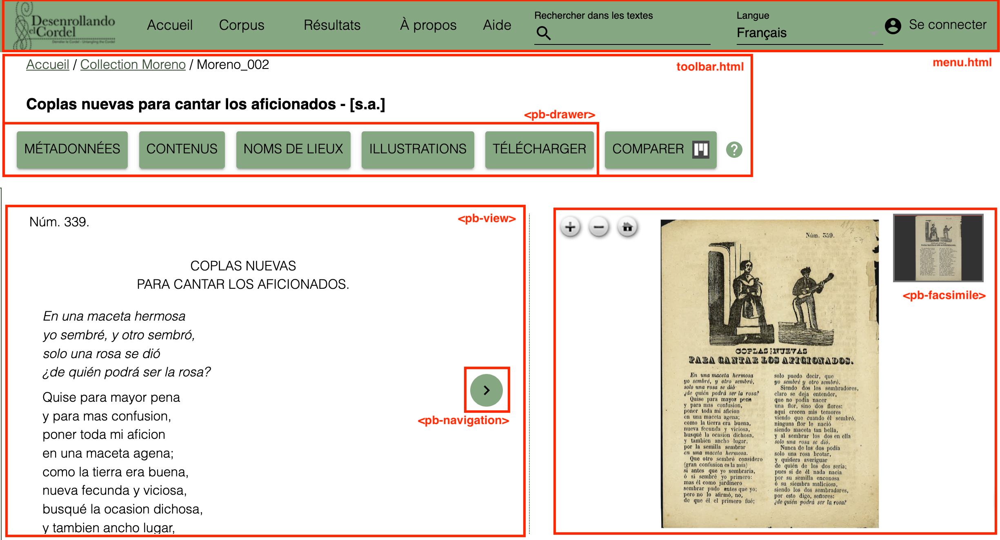

# Les templates

## La notice d’un pliego : page-pliegos.html
<figure>
    
    <figcaption>Figure 1 : Structure du template **page-pliego.html**</figcaption>
</figure>

Ce template permet d’afficher la notice d’un document avec les métadonnées descriptives, le texte et le facsimilé. Il a été créé à partir du template **facsimile.html** proposé par défaut par *TEI-Publisher*.

La page (Figure 1) se compose (de haut en bas) d’un menu de navigation général appelé depuis le template **menu.html** ; d’une barre d’outil appelée depuis le template **toolbar.html** (excepté la génération des boutons) ; d’un espace de consultation des métadonnées et des images ; et d’un pied de page. Les métadonnées, le contenu de la table des matières, les informations sur les gravures et les options de téléchargement sont créés avec l’élément `<pb-drawer>`, qui se situe entre l’élément `<app-header>` et l’élément `<main>`.

Les métadonnées sont affichées en cliquant sur le bouton “Métadonnées”, qui fait glisser un panneau à gauche. Pour cela, nous avons repris et adapté le code utilisé pour afficher la table des matières. Ainsi, elles sont gérées par le web-component `<pb-drawer toogle="metadataToogle">` (Figure 2). Il contient un web-component `<pb-view>`, avec un attribut `@xpath` ciblant le `<teiHeader>`. Le web-component `<pb-param>` définit des paramètres (avec les attributs `@name` et `@value`), repris par l’ODD pour sélectionner les métadonnées à afficher, en utilisant le prédicat suivant lors de la création du *model sequence* : `$parameters?mode='commentary'`. Pour le choix des métadonnées, voir 1.9. Les métadonnées.

<figure>
    
    <figcaption>Figure 2 : Structure du web-component <code>pb-drawer</code> permettant d’afficher les métadonnées</figcaption>
</figure>

L’affichage des métadonnées concernant les gravures suit le même procédé (Figure 3), mais avec le paramètre suivant : `$parameters?mode='figures'`.

<figure>
    
    <figcaption>Figure 3 : Structure du web-component <code>pb-drawer</code> permettant d’afficher la liste des gravures</figcaption>
</figure>

Nous avons ajouté un bouton “Télécharger”, permettant de télécharger le texte ou les images d’un document. Il est construit sur le même modèle que précédemment, avec un web-component `<pb-drawer>`. Pour l’export du texte en .pdf ou en .epub, nous utilisons les fonctions par défaut de *TEI-Publisher* avec le web-component `<pb-download>`.
En ce qui concerne le téléchargement du code source XML TEI et celui des images, nous avons développé des fonctions spécifiques qui renvoient l’utilisateur vers la plateforme Zenodo. Ces fonctions sont contenues dans le fichier **modules/custom-api.xql** (Figure 4). Le bouton “Comparer” est, quant à lui, directement affiché depuis le template **toolbar.html** (Voir 2.3. La barre d’outils).

<figure>
    
    
    <figcaption>Figure 4 : Fonctions utilisées pour télécharger les PDF et les fichiers XML-TEI</figcaption>
</figure>

Le contenu principal de la page est défini avec l’élément `<main class="page-pliegos_ _content-body">`. La transcription est affichée avec un autre web-component `<pb-view>`, lequel est encadré par deux web-components `<pb-navigation>` permettant de changer de pages (Figure 5).

<figure>
    
    <figcaption>Figure 5 : Affichage des transcriptions et des outils de navigation</figcaption>
</figure>

Le web-component `<pb-facsimile>` permet d’afficher les images du document via le protocole IIIF (Figure 6). L’URI de base est celle du serveur de l’Université de Genève : “https://iiif.unige.ch/iiif/2/”. À cette URI, est concaténé le nom le nom de l’image sur le serveur IIIF. Celui-ci est indiqué dans les fichiers TEI, avec l’élément `<pb/>` et son attribut `@facs`. Dans l’ODD, cet élément est transformé en web-component `<pb-facs-link>`, ce qui permet ainsi d’afficher les images dans `<pb-facsimile>` (Voir 1.3. Les changements de page `<pb/>`...).

<figure>
    
    <figcaption>Figure 6 : Affichage des transcriptions et des outils de navigation</figcaption>
</figure>
