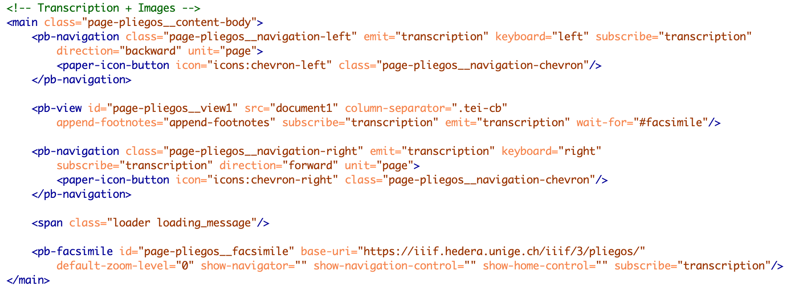
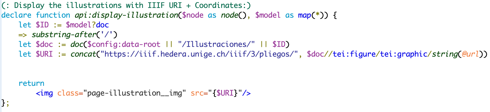

# 2. Les templates

## 2.1. La notice d’un pliego : page-pliegos.html

Ce template permet d’afficher la notice d’un document avec les métadonnées descriptives, le texte et le facsimilé. Il a été créé à partir du template **facsimile.html** proposé par défaut par *TEI-Publisher*.

La page se compose (de haut en bas) d’un menu de navigation général appelé depuis le template **menu.html** ; d’une barre d’outil appelée depuis le template **toolbar.html** ; d’un espace de consultation des métadonnées et des images ; et d’un pied de page. Les métadonnées, le contenu de la table des matières, les informations sur les gravures et les options de téléchargement sont créés avec l’élément `<pb-drawer>`, qui se situe entre l’élément `<app-header>` et l’élément `<main>`.

Les métadonnées sont affichées en cliquant sur le bouton “Métadonnées”, qui fait apparaître un panneau à gauche. Pour cela, nous avons repris et adapté le code utilisé pour afficher la table des matières. Ainsi, elles sont gérées par le web-component `<pb-drawer toogle="metadataToogle">`. Il contient un web-component `<pb-view>`, avec un attribut `@xpath` ciblant le `<teiHeader>`. Le web-component `<pb-param>` définit des paramètres (avec les attributs `@name` et `@value`), repris par l’ODD pour sélectionner les métadonnées à afficher, en utilisant le prédicat suivant lors de la création du *model sequence* : `$parameters?mode='commentary'`. Pour le choix des métadonnées, voir 1.9. Les métadonnées.

L’affichage des métadonnées concernant les gravures suit le même procédé, mais avec le paramètre suivant : `$parameters?mode='figures'`.

Nous avons ajouté un bouton “Télécharger”, permettant de télécharger le texte ou les images d’un document. Il est construit sur le même modèle que précédemment, avec un web-component `<pb-drawer>`. Pour l’export du texte en .pdf ou en .epub, nous utilisons les fonctions par défaut de *TEI-Publisher* avec le web-component `<pb-download>`.
En ce qui concerne le téléchargement du code source XML TEI et celui des images, nous avons développé des fonctions spécifiques qui renvoient l’utilisateur vers la plateforme Zenodo. Ces fonctions sont contenues dans le fichier **modules/custom-api.xql**. Le bouton “Comparer” est, quant à lui, directement affiché depuis le template **toolbar.html** (Voir 2.3. La barre d’outils).

Le contenu principal de la page est défini avec l’élément `<main class="page-pliegos_ _content-body">`. La transcription est affichée avec un autre web-component `<pb-view>`, lequel est encadré par deux web-components `<pb-navigation>` permettant de changer de pages.
Le web-component `<pb-facsimile>` permet d’afficher les images du document via le protocole IIIF. L’URI de base est celui du serveur de l’Université de Genève : “https://iiif.unige.ch/iiif/2/”. À cet URI, est concaténé le nom le nom de l’image sur le serveur IIIF. Celui-ci est indiqué dans les fichiers TEI, avec l’élément `<pb/>` et son attribut `@facs`. Dans l’ODD, cet élément est transformé en web-component `<pb-facs-link>`, ce qui permet ainsi d’afficher les images dans `<pb-facsimile>`.

## 2.2. La notice d’une illustration (illustration.html)

*TEI-Publisher* permet de définir des templates spécifiques en fonction des collections. Dans le fichier **config.xqm**, il faut modifier la fonction `config:collection-config`. Si la collection s’appelle “Ilustraciones”, alors on applique le template **illustration.html**. Sinon, on applique le template par défaut défini dans le même fichier avec la fonction `config:default-template`.

La notice d’une gravure a une organisation plus simple que celle des éditions numériques des documents.

Le fil d’ariane (ou breadcrumb) est créé à l’aide d’une fonction XQuery, qui se trouve dans le fichier **modules/custom-api.xml** et intégré dans chaque notice d’illustration avec `
`.

L’identifiant et la date sont affichés avec l’élément `<app-toolbar>`. Le web-component `<pb-view>` cible l’élément `<fileDesc>` du `<teiHeader>`, tandis que `<pb-param>` définit des paramètres repris par l’ODD avec le prédicat `$parameters?mode='title'`.

Sur le même modèle, les métadonnées descriptives sont affichées avec le web-component `<pb-param>`, qui définit des paramètres (avec les attributs `@name` et `@value`) repris par l’ODD avec le prédicat suivant : `$parameters?mode='illustration'`.

Enfin, l’image est affichée avec l’élément `
`, qui fait appelle à la fonction `api:display-illustration`, contenue dans le fichier **modules/custom-api.xql**. Cette fonction récupère les coordonnées d’une gravure sur l’image de la page et les concatène avec l’URI de base du serveur IIIF de l’Université de Genève. Elle affiche ensuite cette URL dans un élément HTML ``.

## 2.3. La barre d’outils : toolbar.html
Ce template permet d’afficher le titre du document et une barre d’outil : par défaut, *TEI-Publisher* propose une table des matières (générée à partir des `
` et des `<head>` du fichier TEI), l’affichage de la collection d’origine, des zooms, des boutons de navigations et l’accès au fichier source du document. Dans notre cas, nous avons uniquement conservé le titre et la table des matières, auxquels nous avons ajouté quatre autres boutons pour l’affichage de métadonnées (document et gravures), pour le téléchargement et pour la comparaison de documents avec *Mirador*.

Le fil d’ariane est créé avec une fonction XQuery, qui se trouve dans le fichier **modules/custom-api.xql**, et intégré dans la barre d’outil avec l’élément `
`.

Le titre est affiché dans un élément HTML `<section classe="page-pliegos__breadcrumbs">` et créé avec un web-component `<pb-view>`. L’attribut `@xpath` permet de cibler le contenu de l’élément TEI à afficher. `<pb-param>` fournit les paramètres à utiliser dans l’ODD pour l’affichage du titre.

Si le contenu des boutons (sauf le dernier) est généré depuis le template page_pliegos.html (Voir 2.1. La notice d’un pliego), les boutons eux-mêmes sont affichés avec **toolbar.html**, dans un élément `<paper-button>`. Chaque bouton est relié à son contenu via l’attribut `@id` de l’élément `<paper-button>`, qui est repris par l’attribut `@toggle` du web-component `<pb-drawer>` dans le fichier **page_pliegos.html** (Figure 14).

Le bouton “Comparer” n’ouvre pas de panneaux coulissants sur la droite, mais une nouvelle fenêtre dans le navigateur avec l’outil de visualisation *Mirador*. Il est créé avec un élément `<paper-button>`, mais fait appel à la fonction `api:get-manifest` (**modules/api-custom.xql**).

Cette fonction ajoute un lien vers la page **mirador.html** et indique, à la fin de l'URL de cette nouvelle page, l’URI du manifeste du document que l’utilisateur est en train de consulter. Tous les URI des manifestes sont référencés dans le fichier **manifest.xml** (Pour plus de détails, voir 2.8. La comparaison d’images avec Mirador).

## 2.4. Le menu de navigation : menu.html
Le menu de navigation est intégré à chaque page avec un élément `<app-toolbar>`. Celui-ci pointe vers le fichier **menu.html**.

Ce template contient l’ensemble des composants du menu de navigation : le logo, les divers onglets, la barre de recherche, le choix de la langue et les options de connexion.

Le logo est affiché avec un élément `<a class="logo">`. Cette classe est reprise par la feuille de style **cordel_theme.css** et indique le chemin vers l’image du logo.

Les onglets sont affichés soit avec un élément `<a>` (inicio, agenda, enlaces), soit avec un élément `<paper-menu-button>` qui permet de créer des *dropdown-menu*, c'est-à-dire des sous-onglets (colecciones, resultados, acerca de). Chaque onglet et sous-onglet a été traduit avec le web-component `<pb-i18n>` sur le même modèle que le reste du site (voir 5. Le multilinguisme).

La barre de recherche est affichée avec un web-component `<pb-search>`. De même, l’affichage des langues est géré par un web-component `<pb-lang>`.

## 2.5. La liste des contenus (index.html)

L’aide à la recherche est contenue dans une `
`, placée avant la `
` contenant les facettes et la liste des documents.

Le panneau latéral gauche, qui contient les facettes, est affiché avec le web-component `<pb-custom-form>`. Les boutons “Soumettre” et “Effacer” sont ajoutés avec des éléments `<paper-button>`. Les listes pliables ont été créées avec CSS. Pour la création et la gestion des facettes, voir 4.2 Les facettes.

Le panneau contenant la liste des documents est affiché avec le web-component `<pb-browse-docs>`. Celui-ci se compose de nombreux attributs. Certains permettent de paramétrer les options de tri : `@sort-options` contient la liste des métadonnées par lesquelles effectuer le tri et `@sort-by`, le mode de tri par défaut. D’autres définissent des filtres de recherche spécifiques à un type de métadonnées (dans le titre par exemple) : `@filter-options` contient la liste des métadonnées dans laquelle faire une recherche, et `@filter-by`, le filtre à afficher par défaut dans la liste déroulante (pour le paramétrage des filtres, voir 4.3. Les options de tri).

La navigation au sein de la liste et le nombre de résultats par page sont paramétrés avec `<pb-paginate>`. L’attribut `@per-page` permet de définir le nombre de documents à afficher par page. L’attribut `@slot="footer"` permet d’ajouter la barre de navigation en bas de la page.

La liste des documents à proprement parler est affichée avec le template **documents.html**. Il se compose d’une `
` qui appelle la fonction xQuery `browse:list-works` (définie dans le module **browse.xql**). Cette `
` contient une liste HTML `<ul class="documents">`, dont chaque item `<li class="document">` correspond à un document. Celui-ci est contenu dans une nouvelle `
`.

Les métadonnées sont affichées à partir de l’élément `<header>` et de la fonction xQuery `browse:short-header` et de l’ODD. Dans cette dernière, l’élément `<teiHeader>` contient en effet un *model* avec pour prédicat `$parameters?header='short'` (la valeur de ce prédicat est spécifiée par la fonction `browse:short-header` du module **browse.xql**). Nous avons transformé ce model en *modelSequence* afin d’ajouter plusieurs informations : le titre, une vignette de la première page, le colophon et les titres des parties.

Par défaut, *TEI-Publisher* ajoute à chaque élément de la liste un bouton de téléchargement. Celui-ci est généré par le template **documents.html**. Nous avons choisi de ne pas afficher ce bouton, le téléchargement étant réservé à la page des contenus (Voir 2.1. La notice d’un pliego). La portion de code correspondant à ce bouton (contenue entre les balises de l’élément `<app-toolbar>` du template **documents.html**) a été commentée.

## 2.6. Les pages statiques
Nous distinguons deux types de pages statiques : celles avec beaucoup de texte, nécessitant un important travail de traduction, et celles avec peu de texte et quelques traductions (essentiellement les titres). Deux méthodes ont été choisies afin de le créer.

### 2.6.1. Les pages statiques avec beaucoup de texte
Pages statiques concernées : agenda, aviso legal, contacto, criterios de edición, presentación del proyecto, proceso técnico.

#### 2.6.1.1. La création des pages
Dans le dossier **Data**, nous avons créé un dossier **Documentation** contenant des fichiers XML-TEI Lite. Chaque fichier correspond à une page statique et contient le texte dans trois `
` différentes, identifiée par un attribut `@xml:lang`, correspondant aux trois langues du projet (espagnol, français et anglais).

#### 2.6.1.2. La création du template

Pour afficher le contenu des fichiers XML-TEI, nous avons créé un nouveau template **static.html** (dans le dossier **templates/pages**). Ce template contient le menu de navigation (`<app-toolbar>`), ainsi que le texte contenu dans le fichier XML du dossier **data/Documentation**, appelé avec le web-component `<pb-view>`.

Pour associer ce template aux fichiers du dossier **Documentation**, il faut modifier la fonction config:collection-config dans le fichier **modules/config.xqm**, sur le même principe que la collection des illustrations (voir 2.2. La notice d’une illustration).

Pour la mise en page, des règles spécifiques ont été ajoutées à l’ODD (Voir 1.10. Les pages statiques).

#### 2.6.1.3. La traduction des pages
Pour que les pages changent de langue en fonction du choix de l’utilisateur, il faut ajouter des attributs aux éléments `<pb-page>` et `<pb-view>` du template **static.html** :
- `<pb-page>` ⇒ `@require-language="require-language"`
- `<pb-view>` ⇒ `@use-language="use-language"` ; `@map="change-language"`

La valeur de l’attribut `@map` fait référence à la fonction `mapping:change-language` (**map.xql**). Elle permet d’identifier la langue du site Web et d’afficher le texte dans la langue correspondante, en s’appuyant sur la valeur des `@xml:lang` de chaque fichier TEI.

#### 2.6.1.4. La réécriture des URL
Les URL de ces pages ont été réécrites afin de supprimer l’extension .xml. Pour cela, nous avons ajouté un nouvel endpoint, en nous appuyant sur le modèle du projet *Briefe Edition* :
- Dans le fichier **custom-api.xml**, nous avons ajouté la fonction `api:view-about`.
- Dans le fichier **custom-api.json**, nous avons ajouté un nouvel objet `"/Documentation/{doc}"`.

### 2.6.2. Les pages statiques avec peu de texte
Pour toutes les autres pages, nous avons choisi de créer l’ensemble des pages statiques du site en HTML, afin de faciliter leur design. Chaque page reprend et adapte le modèle du template **index.html**. Elles sont stockées à la racine du dossier **templates**.

## 2.7. L’affichage des résultats de recherche (search.html)

Ce template permet d’afficher la liste des résultats d’une requête. Le menu de navigation est ajouté avec **menu.html**. De même que pour **index.html**, la navigation au sein des résultats est affichée avec `<pb-paginate>`.

Le panneau central avec la liste des résultats est affiché avec le web-component `<pb-load>`. La barre de recherche à gauche est contenue dans une `
`.

## 2.8. La comparaison de documents avec Mirador (mirador.html)
Depuis la notice d’un document, en cliquant sur le bouton “Comparer”, l’utilisateur accède à l’outil de visualisation *Mirador*. Cet outil est affiché via la page **Mirador.html** et la librairie JavaScript UNPKG. Ainsi, dans le `<head>` de cette page, nous insérons un élément `<script>`, dont la valeur de l’attribut `@src` est le suivant : https://unpkg.com/mirador@latest/dist/mirador.min.js. Ce script permet d’afficher l’interface de *Mirador* dans l’élément `
`.

Nous ajoutons également, avant la balise fermante de `<body>`, un second élément `<script>` contenant les paramètres de *Mirador*, tels que l’affichage des panneaux de contrôle ou le choix de la  langue de l’interface, ainsi que les images à afficher par défaut, c’est-à-dire l’image du document consulté par l’utilisateur et la liste de tous les autres documents de la collection. Pour cela, nous avons recours à un script JavaScript qui récupère l’ID du manifeste contenue dans l’URL de la page (Voir 2.1. La notice d’un pliego) et la concatène avec l’URI de base du serveur IIIF de l’Université de Genève.

## 2.9. La comparaison de gravures avec VDiff (vdiff.html)
Depuis la notice d’une gravure, en cliquant sur le bouton “Comparer”, l’utilisateur accède à l’outil de visualisation VDiff. Cet outil est affiché avec le template **vdiff.html**. Il reprend la structure des autres templates, mais intègre des fichiers CSS (**resources/css**) et JavaScript (**resources/js**) supplémentaires assurant son fonctionnement.

## 2.10. Le footer (footer.html)
Le fichier **footer.html** (dossier templates) contient les éléments à afficher en bas de chaque page. Il est intégré aux templates avec l’élément suivant : `<footer data-template="templates:include" data-template-path="templates/footer.html"/>`.