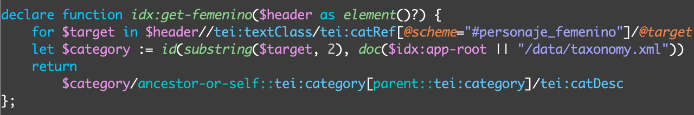

# 4. Les fonctionnalités de recherche

## 4.1. La recherche dans le texte
Les règles d’indexation du corpus sont spécifiées dans le fichier **collection.xconf**. Elles sont contenues dans un élément `<lucene>`. Nous lui avons ajouté un attribut `@diacritics`, avec pour valeur “no”, permettant de faire des recherches sans tenir compte des accents.
Cet élément contient des sous-éléments `<text>` avec un attribut `@qname` qui cible les éléments TEI à indexer (Attention à ne pas oublier le namespace devant le nom de l’élément !).

Ces règles permettent d’effectuer des recherches dans le texte brut des documents, dont les résultats sont affichés via le template **search.html** (Voir 2.7 L’affichage des résultats). Les modalités de recherche et d’affichage (i.e. kwic, nombre de résultats, breadcrumbs, etc.) sont, quant à elles, définies dans le module **query-tei.xql**. Pour les besoins de notre projet, nous avons modifié la fonction `teis:get-breadcrumbs`.

## 4.2. Les facettes
Trois étapes sont nécessaires pour paramétrer les facettes : 1) la définition des facettes dans le fichier **index.xql** ; 2) la configuration de l’affichage des facettes avec **config.xqm** ; 3) l’indexation des données avec **collection.xconf**.

### 4.2.1. Étape 1 : La définition des facettes (index.xql)
#### 4.2.1.1. Les facettes pour les collections de documents
La fonction `idx:get-metadata` permet de définir les métadonnées à transformer en facettes. Pour cela, il faut leur attribuer un identifiant (`case "language" return`), puis indiquer le chemin XPath jusqu’à l’information (`$header//tei:langUsage//tei:language`).

Sur le modèle du projet Van Gogh, nous avons ajouté une fonction (`idx:parse-date`) permettant de regrouper les dates sous un même label (Années 1840, 1850, etc.).

#### 4.2.1.2. Les facettes pour la collection de gravures
Les facettes qui concernent uniquement les gravures ne sont pas récupérées avec un chemin XPath, mais avec une autre fonction (`idx:get-{mot-clé}`). Ces informations sont en effet liées à une taxonomie définie dans le fichier **taxonomy.xml** (**/resources/data**). C’est un fichier TEI qui contient différentes catégories de mots-clés à partir desquelles sont décrites les gravures.

Ces catégories sont ensuite utilisées dans les fichiers TEI, avec un élément `<catRef>`. Chaque mot-clé est indiqué dans un attribut `@target` et la catégorie dans un attribut `@scheme`.

Dans le fichier **index.xql**, pour chaque catégorie de mots-clés du fichier **taxonomy.xml**, nous créons une fonction qui cible cette catégorie (ex: `idx:get-femenino`) et indexe les mots-clés, afin de créer les facettes correspondantes. Cette fonction est à son tour utilisée par la fonction `idx:get-metadata`.

### 4.2.2. Étape 2 : Configuration de l’affichage (config.xqm)
L’affichage des facettes (via **index.html** et **search.html**) est spécifié dans le fichier **config.xqm**, avec la variable `$config:facets`. Chaque facette est décrite avec une `map`. Celle-ci indique l’identifiant de la facette à paramètrer (i.e. celui défini dans **index.xql**), le titre à afficher, le nombre de facettes maximum à montrer (les autres seront affichées par l’utilisateur en cliquant sur une case), leur aspect hiérarchique (i.e. si les informations sont imbriquées les unes dans les autres), ainsi que la manière de les traduire à l’aide de web-component `<pb-i18n>`.

### 4.2.3. Étape 3 : L’indexation des facettes (collection.xconf)
Pour indexer les informations et créer les facettes, il faut ajouter dans l’élément `<text>` du fichier **collection.xconf** des sous-éléments `<facet>` (Figure 41). Ceux-ci se composent d’un attribut `@dimension`, qui cible l’identifiant défini dans **index.xql**, et d’un attribut `@expression` indiquant, sous la forme d’une fonction, les éléments TEI à indexer. Le seul élément à modifier dans cette fonction est le deuxième élément de la parenthèse, qui reprend l’identifiant choisi dans **index.xql**.

Lors de la sauvegarde de ce fichier (toujours depuis *Exide*), l’ensemble des données sera ré-indexé à partir des nouvelles règles définies.

### 4.2.4. Étape 4 : L’organisation des facettes (facets.xql)
Par défaut, les facettes sont organisées par ordre alphabétique. Nous avons choisi de les organiser par ordre décroissant, c’est-à-dire en faisant apparaître en premier les facettes qui ont le plus d’items. Pour cela, nous avons modifié la fonction `facets:sort` du fichier **facets.xql**, afin que ce soit les valeurs (`$value`), et non les clés (`$key`), qui soient pris en compte dans le tri par ordre (avec `order by`). Nous avons également remplacé le mot-clé `ascending` par son contraire, `descending`.

Lorsque l’utilisateur sélectionne une facette, la liste des contenus se modifie automatiquement. Pour permettre à l’utilisateur de sélectionner plusieurs facettes à la fois, nous avons modifié le comportement par défaut de *TEI-Publisher*, en suivant et adaptant le modèle du projet [Eltec](https://github.com/eeditiones/eltec).

Dans le template **index.html**, nous avons commenté le script Javascript qui gère les facettes dynamiques, et ajouté deux éléments `<paper-button>` pour soumettre et effacer une requête. Le bouton "Effacer" fait appel à une fonction Javascript spécifique, placée avant la balise fermante de `<body>`.

Dans le fichier **facets.xql**, nous avons modifié la fonction `facets:display` afin que celle-ci permette de sélectionner plusieurs facettes et d’afficher les résultats correspondant.

## 4.3. Les options de tri
Les *fields* permettent de trier les documents d’une collection ou d’effectuer des requêtes dans un champ de métadonnées spécifique. Dans notre cas, nous avons choisi de trier les documents par titre et par date.

### 4.3.1. Étape 1 : L’indexation (collection.xconf)
Les options de tri sont définies sur le même modèle que les facettes, en utilisant l’élément `<field>`. Il se compose d’un attribut `@name`, qui donne un identifiant au filtre, et d’un attribut `@expression`, qui indique à l’aide d’une expression XPath, les éléments TEI sur lesquels repose le filtre. Il est également possible d’associer des types de valeurs XQuery (`xs:date`, `xs:integer`, etc.), qui améliorent les performances du tri. Ainsi, pour le filtre “date”, nous avons ajouté un `@type="xs:date"`.

### 4.3.2. Étape 2 : L’affichage des options de tri (index.html)
Le choix des options de tri est défini dans le fichier **index.html** avec le web-component `<pb-browse-docs>`. Il se compose tout d’abord d’un attribut `@sort-options`. Sa valeur est une map, constituée d’un label avec le nom à afficher sur l’interface et d’une valeur qui reprend la valeur de l’attribut `@name` dans le fichier **collection.xconf**.
L’attribut `@filter-options` est construit sur le même modèle que `@sort-options`. Il permet d’afficher une barre de recherche dédiée à une métadonnée en particulier. Dans notre cas, nous avons uniquement choisi de faire des recherches dans les titres.

