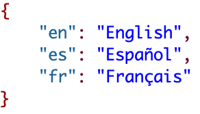
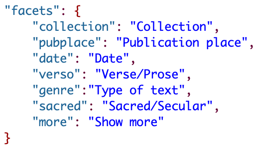
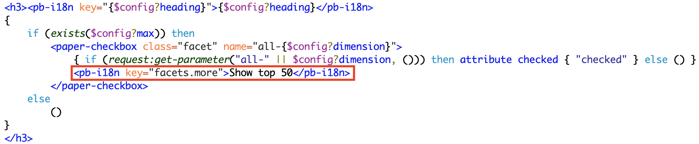

# 5. Le multilinguisme
L’interface par défaut de *TEI-Publisher* est traduite automatiquement à l’aide d’attributs `@data-i18n` ou du web-component `<pb-i18n>`.

Les traductions supplémentaires sont définies dans le dossier **resources/i18n/app**, sous la forme de fichiers .json (un pour chaque langue : **en.json**, **es.json** et **fr.json**). Le dossier i18n contient également un fichier **languages.json**, qui permet de sélectionner les langues de l’interface. Parmi les langues proposées par *TEI-Publisher*, nous avons sélectionné le français, l’espagnol et l’anglais.

Pour inclure des traductions personnalisées dans les templates, il faut ajouter au web-component `<pb-page>` l’attribut  `@locales`, avec pour valeur `resources/i18n/{{ns}}/{{lng}}.json`.

Par exemple, pour traduire le label des facettes, dans chaque fichier .json, il faut choisir une clé unique qui identifie chaque label, et lui associer une traduction

Cette clé est ensuite reprise dans le fichier **config.xqm** (variable `$config:facets` : Voir 4.2.2. Configuration de l’affichage) de la manière suivante : facets.[cle_unique]. Par exemple, pour afficher les traductions du label de la facette “Collection”, il faut utiliser `facets.collection`.
La clé “more” est utilisée avec le web-component `<pb-i18n>` dans le fichier facets.xql (`fonction facets:display`, Figure 51).

