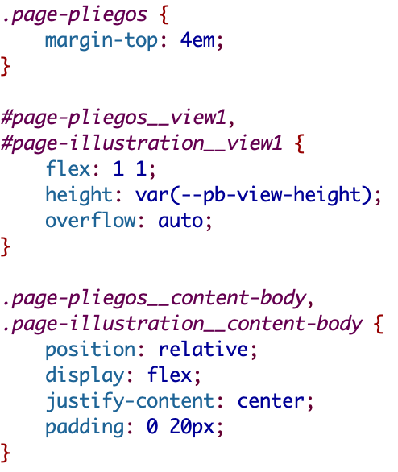

# 6. Les feuilles de style

L’ensemble des styles, c’est-à-dire ceux de la feuille de style par défaut (**theme.css**) et ceux contenus dans chaque template, a été réuni au sein d’une feuille de style unique (sauf pour **index.html**) : **cordel_theme.css**. Lorsque cela est possible, nous privilégions les classes à l’usage des identifiants ou des éléments. Les noms des classes respectent, dans la mesure du possible, la méthodologie BEM (Bloc Éléments Modificateurs) : `[Bloc parent]_ _[Fonction]--[Modificateur]`.

Les styles propres à certains éléments TEI (comme les titres ou les métadonnées) sont définis avec la feuille de style **odd_style.css** (**/resources/odd**).
La charte graphique utilisée est la suivante :
- Couleur primaire (Vert) : #85A782
- Couleur secondaire (Violet) : #663399
