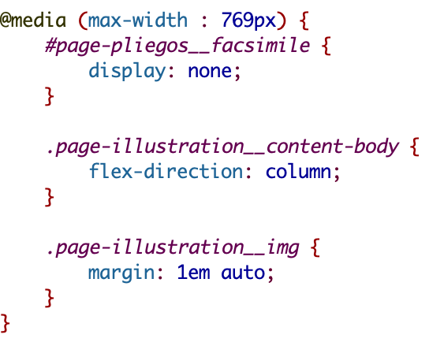
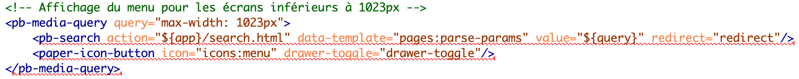
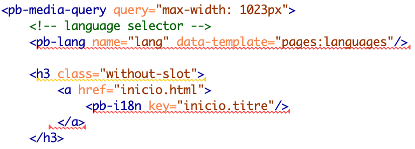
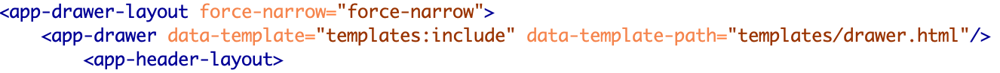

# 7. Le responsive design

La plupart des règles pour le *responsive design* (*media queries*) sont gérées depuis la feuille de style **cordel_theme.css**.

Une exception est faite pour le menu de navigation. En effet, pour créer un menu responsive, TEI-Publisher a recours au web component <pb-media-query>, dont l’attribut @query précise la taille de l’écran. Nous avons adapté à nos besoins le code proposé par défaut et appliqué ce code à l’ensemble des pages (Par défaut, TEI-Publisher a choisi des méthodes différentes en fonction des pages).
Le menu de navigation est créé avec **menu.html**. Ce fichier contient un premier élément `<pb-media-query>` qui gère l’affichage du menu pour des écrans de plus de 1024px ; le second élément `<pb-media-query>`, les écrans de moins de 1024px. Dans ce cas, la barre de menu est réduite au logo du projet, à la barre de recherche et à l’icône d’un *hamburger menu*.

Le contenu de ce *hamburger menu* est affiché depuis le template **drawer.html**. Celui-ci contient la liste des éléments à afficher : par exemple, les langues et le menu de navigation.

Chaque template appelle le template **drawer.html** avec l’élément `<app-drawer>` et l’attribut `@data-template-path`. Cet élément doit être placé entre la balise ouvrante de `<app-drawer-layout>` et celle de `<app-header-layout>`.

En ce qui concerne le template index.html, il faut enlever l’élément `<app-drawer>` (`@slot="toggle"`) qui définit le contenu du *hamburger menu*, et utiliser à la place le template **drawer.html** (même emplacement que dans les autres templates).
Attention ! Pour la page **search.html**, après l’élément `<pb-page>` il faut ajouter l’élément `<app-drawer-layout force-narrow="force-narrow">`, puis l’élément `<app-drawer>` qui fait le lien vers **drawer.html**.