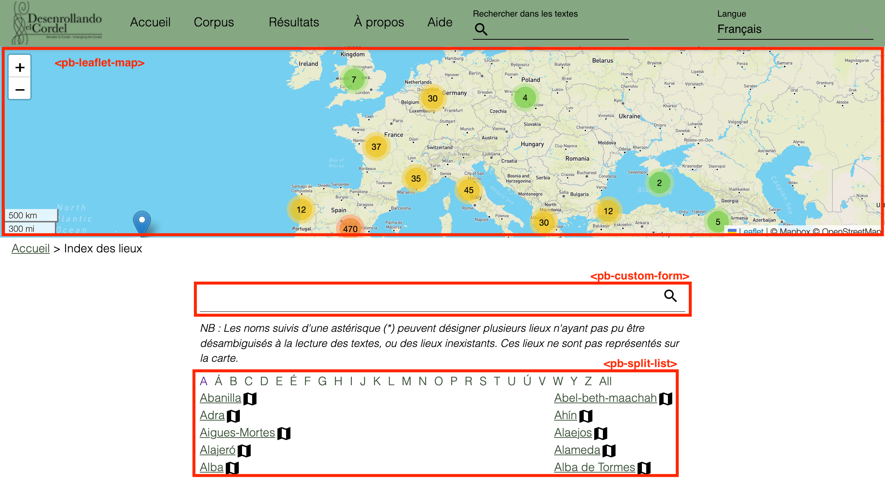
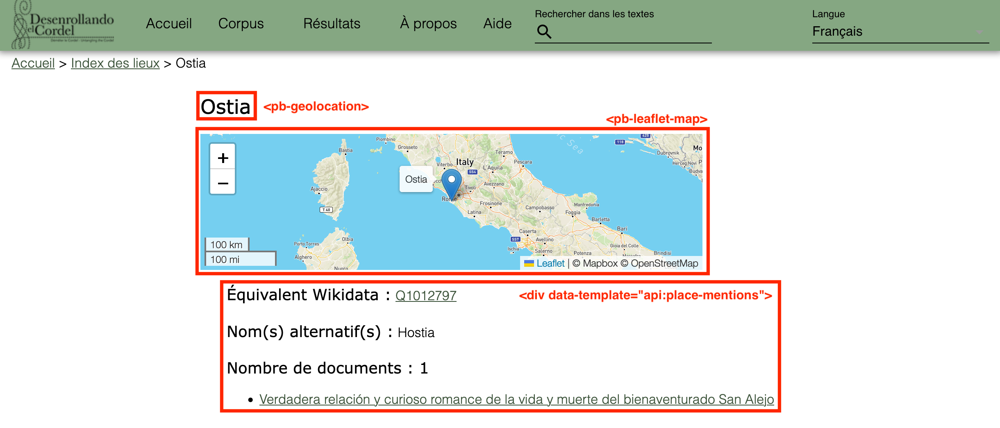

# 8. L'index des noms de lieu

La création de l'index des noms de lieu s'appuie sur le [tutoriel](https://faq.teipublisher.com/api/) et le [code](https://github.com/stazh/briefedition-escher) réalisés pour le projet *Briefe Edition*. Cette section détaille les étapes, ainsi que les modifications apportées au code d'origine.

## 8.1. Création de l'index (places.html)

- Création d'un nouveau *API endpoint* dans le fichier **custom-api.json**, en ajoutant un nouveau *path* : `/api/places`.
- Dans le fichier **custom-api.xql**, ajout d'une première fonction (`api:places`), qui permet d'afficher les noms de lieu par ordre alphabétique.

- Ajout d'une deuxième fonction (`api:output-places`) qui affiche les noms de lieu dans la liste sous la forme de liens avec une icône à droite de chaque nom. Cette icône recentre la carte sur le lieu sélectionné à l'aide du web-component `<pb-geolocation>`. Nous avons modifié le code d'origine en ajoutant une condition. Celle-ci nous permet d'ajouter une astérisque à côté des noms de lieu ambigüs ou inexistants.

- Création du template **places.html** (dans le dossier **templates**). Ce fichier HTML contient un web-component `<pb-leaflet-map>` qui permet d'insérer une carte.

- Pour que des *pointers* signalant des lieux apparaissent sur cette carte, il est nécessaire de créer un nouveau *API endpoint* dans le fichier **custom-api.json**, avec pour path `/api/places/all`. Ce nouveau endpoint nécessite à son tour une fonction (`api:places-all`), à ajouter dans le fichier **custom-api.xql**. Elle récupère le nom du lieu et ses coordonnées géographiques afin de les afficher sur la carte.

- Réécriture de l'URL à l'aide d'un nouveau endpoint (path : `/contexts/places`) sous la forme **desenrollandoelcordel.unige.ch/contexts/places**.

## 8.2. La notice d'un nom de lieu (place.html)

Les notices des noms de lieu sont créées avec le template **/pages/place.html**. Il contient une carte (`<pb-leaflet-map>`), ainsi que des informations sur l'équivalent Wikidata, les graphies alternatives, le nombre de documents et la liste des documents.

Ces informations sont extraites des fichiers TEI à l'aide de la fonction `api:place-mentions`, qui elle-même utilise la fonction `api:document-list` pour créer une liste avec les titres des documents où apparaît un lieu. Les lieux inclassables disposent également d'une notice, avec la mention du nombre de documents et la liste des titres.

Les URLs de ces notices sont également réécrites sous la forme **desenrollandoelcordel.unige.ch/contexts/places/Barcelona**, en ajoutant un endpoint (path : `/contexts/places/{name}`) dans le fichier **custom-api.json**.

## 8.3. L'affichage de la liste des noms de lieu (page-pliegos.html)

Chaque édition d'un document s'accompagne d'un bouton **Noms de lieu**, construit sur le même modèle que les boutons **Métadonnées** ou **Illustrations** (Voir [02-templaces.md](02-templates.md)).

L'ODD définit des paramètres permettant d'afficher dans ce panneau la liste de tous les noms de lieu présents dans le texte. Ceux-ci sont listés dans l'élément `<listPlace>` de chaque fichier TEI. Chaque élément de cette liste est cliquable et ouvre une page avec la notice du lieu sélectionné.

