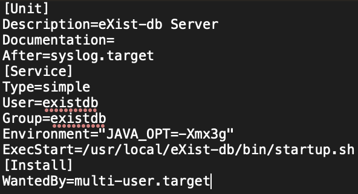
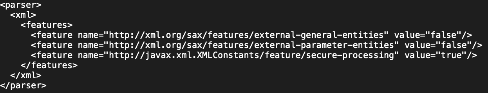
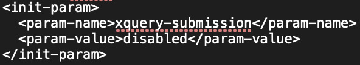
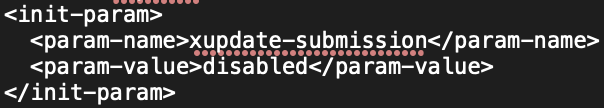
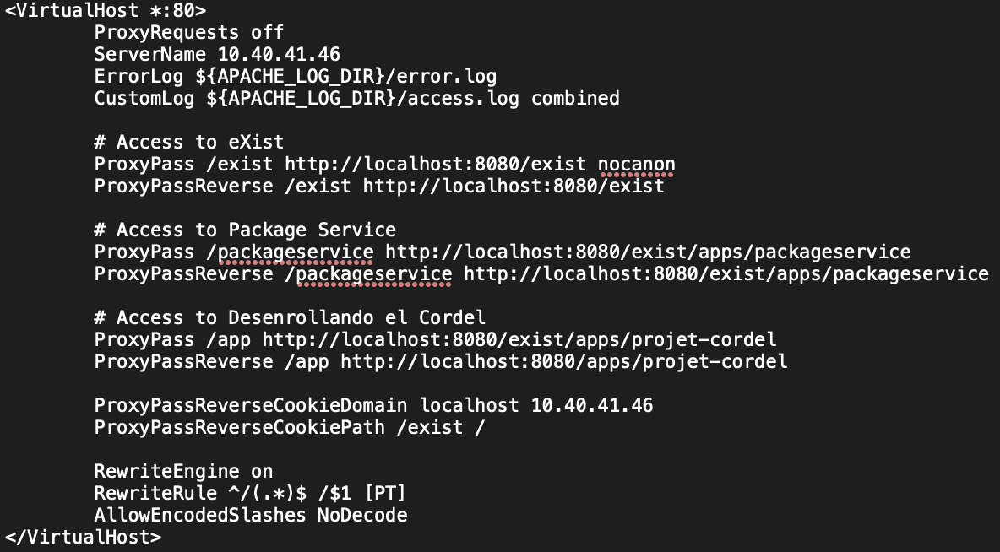

# 8. La mise en place du serveur

Pour mettre en ligne le site web, nous avons besoin d’un serveur proxy, dans notre cas [Apache HTTP Server](https://httpd.apache.org/), afin que les utilisateurs interagissent avec ce serveur, et non directement avec *eXist-DB* qui leur est “caché” (*reverse-proxy*). Étapes à suivre :

- Installation d'Apache 2 :
  - Mise à jour des packages : `sudo apt-get update`
  - Installation d’Apache : `sudo apt-get install apache2`
- Installation de Java : `sudo apt-get install openjdk-11-jre`
- Vérification de l’installation de Java : `java -version`
- Installation d’eXist-DB :
  - Téléchargement des fichiers d’installation : `wget -cO - https://github.com/eXist-db/exist/releases/download/eXist-6.0.1/exist-installer-6.0.1.jar > exist-installer.jar`
  - Lancement de l’installation : `java -jar exist-installer.jar`
- Configuration d’eXist-DB pour qu’il fonctionne comme un background service :
  - Création d’un nouvel utilisateur : `sudo adduser --system --shell /sbin/nologin existdb`
  - Création d’un nouveau groupe d’utilisateurs : `sudo addgroup --system --shell /sbin/nologin existdb`
  - Se rendre dans le dossier d’eXist : `cd /usr/local/eXist-db/data`
  - Changement d’utilisateur : `sudo chown -R existdb eXist-db`
  - Changement de groupe : `sudo chgrp -R existdb eXist-db`
  - Se rendre dans le dossier system : `cd /etc/systemd/system`
  - Création d’un fichier de configuration exist-db.service : `sudo nano exist-db.service`. Contenu du fichier :
    
  - Changement d’utilisateur : `sudo chown existdb exist-db.service`
  - Changement de groupe : `sudo chgrp existdb exist-db.service`
- Configuration des paramètres de sécurité d’eXist-DB :
  - Modification du fichier **conf.xml** :
    - Désactiver l’option Java Binding : `<xquery enable-java-binding="no"/>`
    - Activer les parsers XML (en décommentant la section suivante) :
      
  - Modification du fichier **$EXIST_HOME/etc/webapp/WEB-INF/web.xml** :
    - Désactiver les requêtes XQuery :
      
    - Désactiver XUpdate :
      
- Lancement d’eXist-DB :
    - Start : `sudo systemctl start exist-db.service`
    - (Stop : `sudo systemctl stop exist-db.service)`
    - Configuration de l’autostart : `sudo systemctl enable exist-db.service`
    - Vérification des services tournant sur le serveur : `systemctl | grep running`
- Mise en place du proxy avec Apache :
    - Se rendre dans le dossier suivant : `cd /etc/apache2/sites-available`
    - Création d’un fichier de configuration : `sudo nano 001-cordel.conf`. Contenu du fichier :
      
    - Enregistrer le fichier.
    - Installer les modules Apache suivants : `sudo a2enmod proxy_http proxy lbmethod_byrequests proxy_balancer rewrite`
    - Redémarrer Apache : `sudo service apache2 restart`
    - Activation du site : `sudo a2ensite 001-cordel`
    - Relancer Apache : `sudo service apache2 reload`
- Il est maintenant possible d'accéder au dashboard d’eXist-DB via un navigateur web et d’installer l’application projet-cordel.

## Ressources utiles
- Tutoriel pour mettre en place un reverse-proxy avec eXist-DB : [https://platformdh.uantwerpen.be/index.php/2020/02/21/tutorials-installing-and-reverse-proxying-exist-db-5-on-an-ubuntu-18-04-server/#cp2](https://platformdh.uantwerpen.be/index.php/2020/02/21/tutorials-installing-and-reverse-proxying-exist-db-5-on-an-ubuntu-18-04-server/#cp2)
- Documentation officielle d’eXist-DB pour la mise en place d’un serveur Web : [http://exist-db.org/exist/apps/doc/production_web_proxying](http://exist-db.org/exist/apps/doc/production_web_proxying)
- Documentation officielle pour faire fonctionner eXist-DB comme un service : [https://exist-db.org/exist/apps/doc/advanced-installation#service](https://exist-db.org/exist/apps/doc/advanced-installation#service) 
- Paramètres de sécurité d’eXist-DB : [http://exist-db.org/exist/apps/doc/production_good_practice.xml?field=all&id=D3.13#D3.13](http://exist-db.org/exist/apps/doc/production_good_practice.xml?field=all&id=D3.13#D3.13)
- Encodage des URL avec Apache : [https://faq.teipublisher.com/general/proxy/](https://faq.teipublisher.com/general/proxy/)

